# PeakPerformance

------------------------------------
 

 

-----

## Table of Contents

--------------------------------------

- [About](#about)
- [Design](#design)
- [Agile Development](#agile-development)
- [Features](#features)
- [Testing](#testing)
- [Technologies Used](#technologies-used)
- [Deployment](#deployment)
- [Credits](#credits)

 

------
 

 

## About

 

[PeakPerformance]()

Welcome to Peak Performance, your one-stop destination for all things fitness! Our gym website is dedicated to helping you reach the pinnacle of your fitness journey. Explore our extensive range of premium nutritional products, carefully curated to fuel your body and optimize performance. Elevate your workouts with top-notch gym equipment designed to push your limits and achieve your goals. Show off your style and dedication with our stylish and comfortable apparel, perfect for both in and out of the gym. Whether you're a seasoned fitness enthusiast or just starting, Peak Performance is here to support you every step of the way, ensuring you reach new heights in your fitness endeavors. Unleash your true potential with us!

<https://peak-perfomance-2c33a326e9fb.herokuapp.com/>
 

---
---
 

### Project Goals

PeakPerformance is my fifth and final Portfolio Project for Code Institute's Diploma in Full Stack Software Development (E-Commerce Applications). It is a Full Stack website aimed at covering HTML,CSS,Javascript,Bootstrap, Python and Django.

---

E-Commerce Model

PeakPerformance is an B2C e-commerce platform that specializes in selling gym/nutritional products to consumers. he goal is to provide customers with  good value, high quality products.  The target market for the website is aimed at fitness enthusiasts of all ages.  This is a Business to Consumer model and it aimed at appealing to customers and guests. It features a newsletter signup form where customer will be offered incentives such as exclusive deals, discounts, or relevant content to encourage signups.

 

Buisness Owner

The buisness owner aims to create a thriving eCommerce site for nutritional products, attracting more customers through an attractive design and secure payments. They seek an interactive frontend to manage inventory effectively. They will be able to add, edit and delete stock when nessasary

 

SEO 

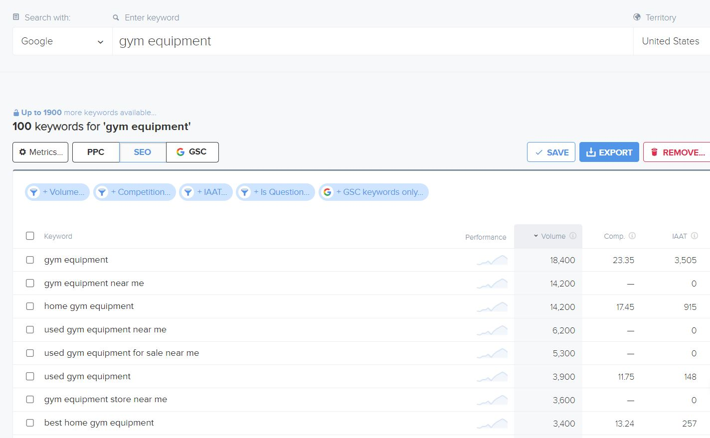

 

Marketing  Stragegy 

I successfully implemented an effective marketing strategy for my ecommerce website through a dedicated Facebook business page. Leveraging the power of social media, I crafted engaging and informative images that showcases the products.This comprehensive approach of buildina a Facebook business page significantly expanded the online presence of the website, attracting a larger customer base and contributing to increased sales and brand loyalty.
 

Facebook buisness page

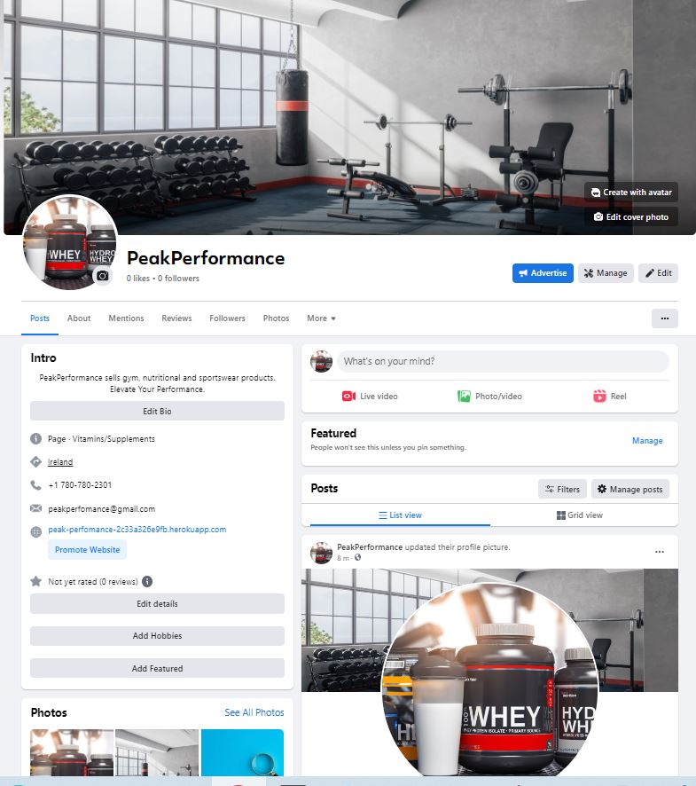

## Design/UX

 

#### Structure of the app

 

The app is designed to have a natural flow, with the main focus on showcasing the products. All the pages include a header with navagation links to login/logout/sign up and links to all the pages. The website includes a footer at the bottom of each page with links to social media.

### Entity relationship diagram

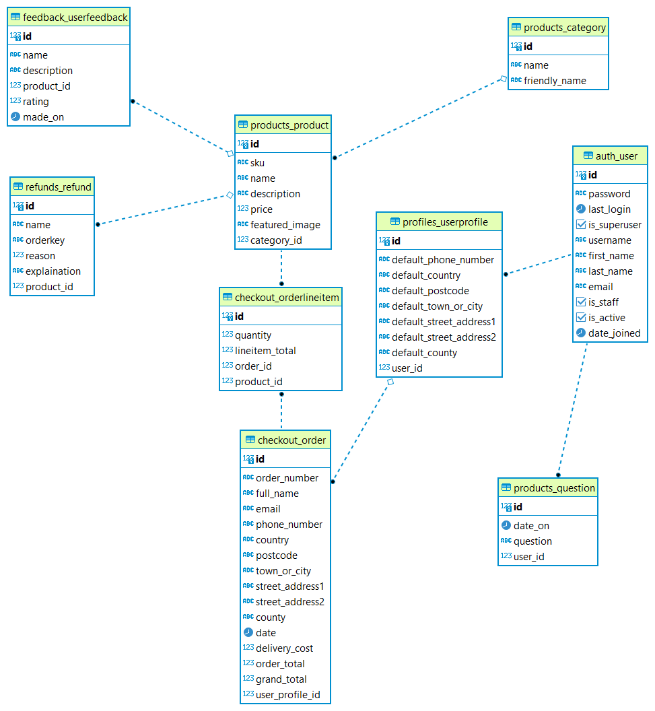

#### Wireframes

 

 

I used Balsamiq to build wireframes for the website before I began developement.

 

 

- Wireframe for the Home page

 

 

- Wireframe for the products page

 

-------------

 

- Wireframe for the product detail page

 

 

-------------

 
 

## Agile Development

 

I employed the Agile approach for my project, highlighting collective effort, adaptability, and client contentment. A fundamental element in Agile methodology is the use of user stories.

I orchestrated and oversaw user stories for my web project through GitHub issues. I formulated user stories pertaining to the capabilities and functionalities.

I charted out my user stories onto the GitHub project board for my website. I established a dedicated GitHub repository for my undertaking and leveraged the GitHub project tool to monitor the user stories. Each user story was interlinked with a corresponding GitHub issue, and priority levels were indicated using distinct labels.
 

 

---

## User Stories

 

I brainstormed User Stories for my website and used the Github projects feature to track them

I add two labels for the user stories which are "must have" and "could have"

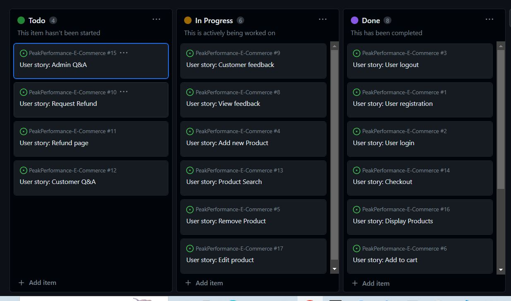

 

### Epic 1: User Authentication
  
 

#### User story: User Register

As a Site user I can register an account for the website so that I can use the websites main features

#### Acceptance Criteria

- User can register an account with username and password.
- Redirected to home page

---

#### User story: User Login

As a User I can login in to my account so that I can view profile and purchase products

#### Acceptance Criteria

- User can login and see their name in navbar

---

#### User story: User logout

As a Site User I can logout of my account so that I can stop using website features

#### Acceptance Criteria

- User can logout. No longer can view profile page.

---

 

### **Epic 2: Products**

 

#### User story: Product display

As a Site owner I can a display a list of the stores producta  so that a the customer can see them

#### Acceptance Criteria

- Products page contains all the product cards

---

#### User story: Product Search

As a Site User I can use a search bar for the website products so that find a product quickly

#### Acceptance Criteria

- User can find a product by typing words that correspond to its name or description

---

#### User story: Add new Product

As a Admin I can add a new product so that I can increase the stores stock

#### Acceptance Criteria

- A form page for admin to add a new product to the store

---

#### User story: Edit product

As a Site owner I can edit an existing product so that I update it for the store

#### Acceptance Criteria

- Admin can edit the product with a button on the products page

---

#### User story: Remove product

As a Site owner I can delete a product so that I can remove unneeded stock

#### Acceptance Criteria
 
- Admin can delete a product from the product page

---

 

### **Epic 3: Cart Fuctionality**
  

 

#### User story: Add to cart
As a Site User I can add a product to the cart so that proceed to purchasing it

#### Acceptance Criteria
Form available to add product to bag
User can change quantity in the form

---

#### User story: Remove from cart
As a Site User I can remove a product from cart so that I can change my order

#### Acceptance Criteria

- In cart page, User has button to remove particular product from cart.

---

 

### **Epic 4: Contact**

 

#### User story: Admin Q&A

As a Site Owner I can answer the customers questions form** so that I give them the required info

#### Acceptance Criteria

- Site owner can submit an answer with front end form

---

#### User story: Customer Q&A

As a Site user I can ask and view questions about the products so that get better understanding of the products

#### Acceptance Criteria

- User can view a list of questions.

- User can submit a new question

---

#### User story: Customer feedback
As a Site user I can submit a feedback form so that I can review the website and its product

#### Acceptance Criteria

- User can submit a form including the Product and its category

---

#### User story: View feedback

As a Site owner I can view customers feedback forms so that I can learn ways to improve the website

#### Acceptance Criteria

- Site owner can view a feedback page with the submitted forms from customers

---

#### User story: Request Refund

As a Site user I can submit a refund form so that I can get my money back if product is not up to standard

#### Acceptance Criteria

- User can submit a request form with their order number

---

#### User story: Refund page

As a Site owner I can view a page with all the refund requests so that begin processing refunds

#### Acceptance Criteria

- Owner can view a page with a table of the refunds

---

#### User story: Newsletter

As a Site user I can sign up to the websites newsletter so that I can receive the latest offers and news

#### Acceptance Criteria

- Site user can submit their email in a frontend form

---

 

### Epic 5: **Checkout**

 

#### User story : Stripe/Checkout

As a Site user I can checkout my products so that I can pay and receive my products

#### Acceptance Criteria

- User can fill out their profile and card details.
  
- Stripe handles payment

---

 

 

------

 

## Features

 

### Navagation Bar

The nav bar allows site users to signup/login/register and visit each page. It features a cart link on right side and drop down menus for account and admin

 

### Home Page

The home page gives the user information about the website. It allows them to register/login/logout and navagate to the products page. It features a carousel of three images.

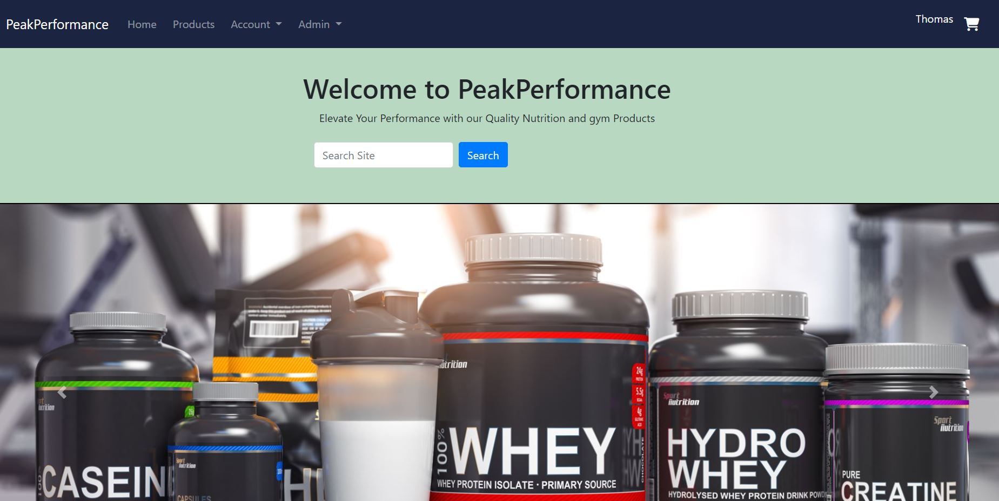

### Footer

The footer provides site users with links to the facebook buisness page

### Registering an account

This feature allows users to registered an account ontthe website. Users will need to enter their username and password to access their account. Email is optional. Once logged in, they will be able to unlock all the website features.

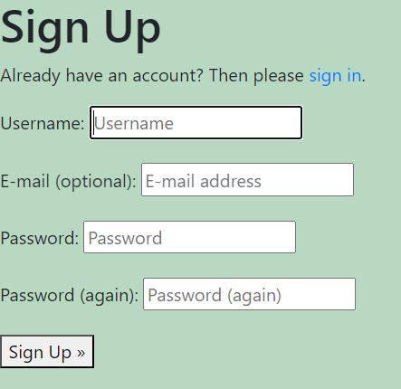

### Products

All the products in the inventory are listed on the product page.
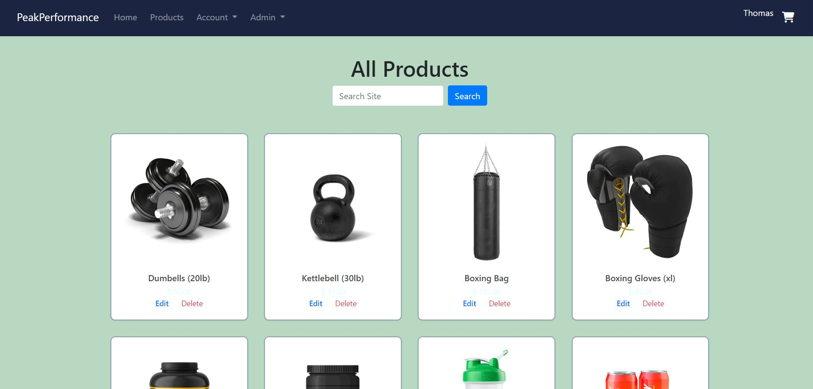

This feature allows users to edit or update their existing expenses. Users can modify the details of an expense such as the date, amount, category, or description. This feature is useful when users make a mistake or need to make changes to their expenses.

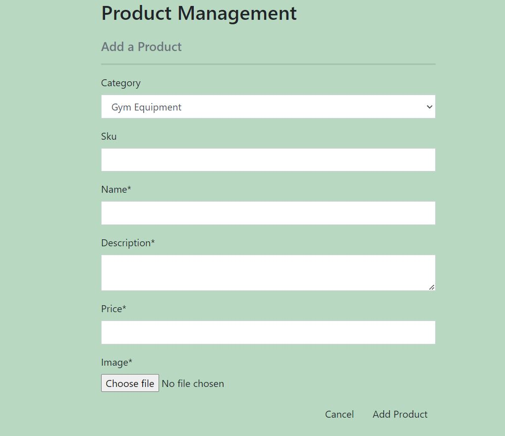
### edit
This feature allows the admin to edit or update their existing products in the inventory. They can modify any details. This feature is useful when users make a mistake or need to make changes to their expenses.

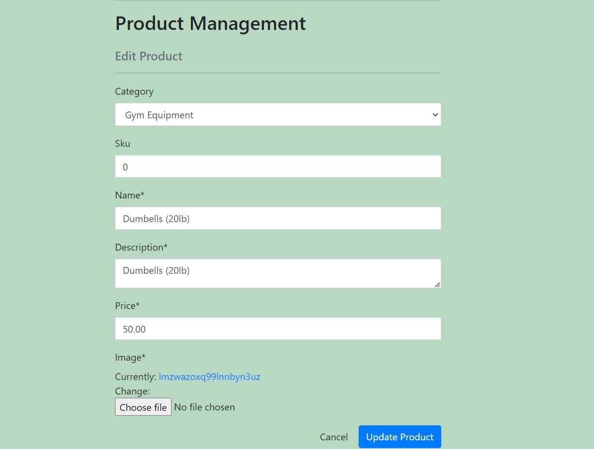
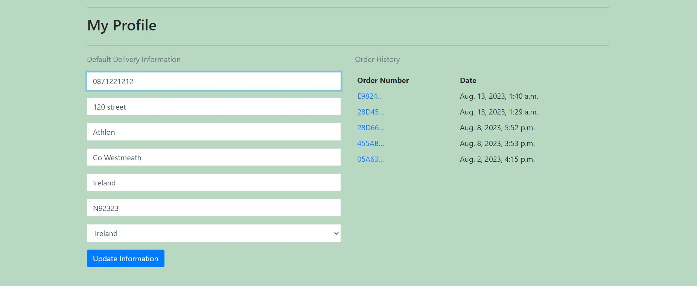

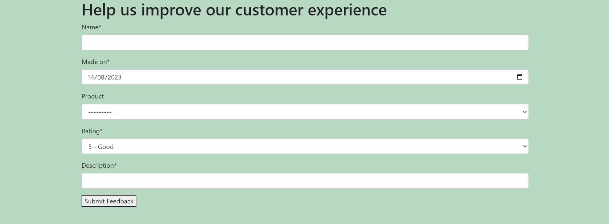
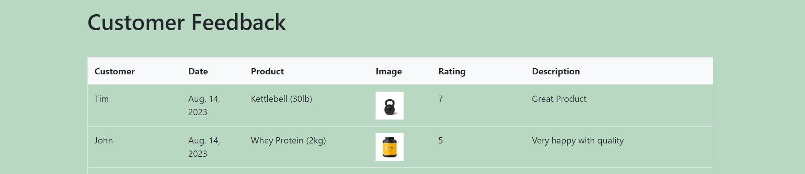
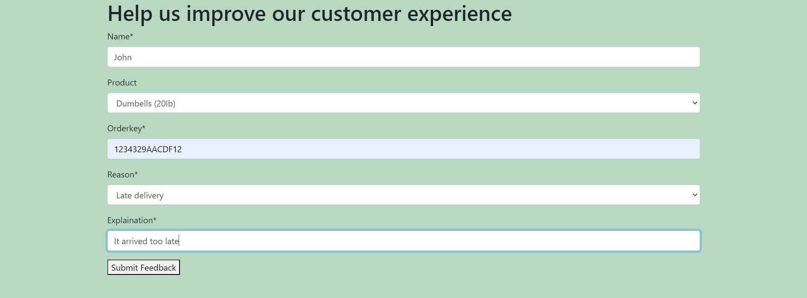
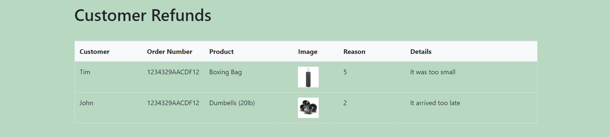

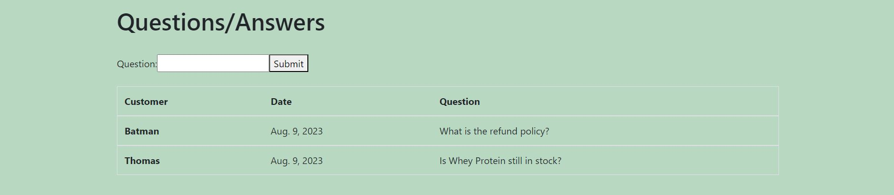

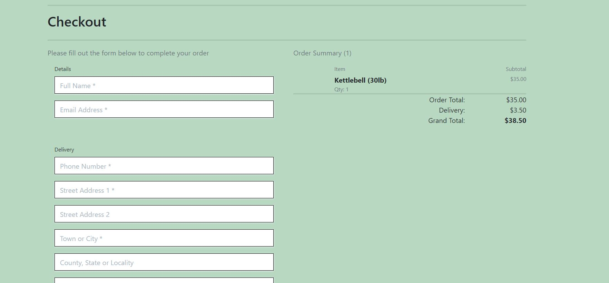

 

---------
 

### Expenses Page

 

THe expenses page allows users to create, add, update and delete expenses. They can adjust their total budget and see the expenses total subtracted from it. It also allows them to register/login/logout and navagate to the Home page

 

 

---------

 

### Nav Bar

The nav bar allows site users to signup/login/register and visit each page.

 

---------

 

### Footer

 

The footer provides site users with links to social media.

 

 

---------

 

### User Register

 

 

 

---------

 

### User Login

 

 

 

-----------

 

### User Logout

 

User logout: This feature allows users to log out of their account when they are finished using the website. Logging out ensures that their account remains secure and that no one else can access their expenses.

 

 

---------------

 

### Budget calculator

 

This feature allows users to set a budget for a specific period, such as a month or a week, and track their expenses against that budget. Users can input their budget and their expenses will be subtracted from it. The calculator shows how much of their budget is left to spend

 

 

 

----------

 

### Read Expenses

 

This feature allows users to view their existing expenses. Users can see a list of all their expenses on a single page.This feature helps users keep track of their spending and identify areas where they might need to cut back.

 

 

------

 

### Create Expenses

 

This feature allows users to add new expenses to their account. Users can input details such as the date, amount and namen of each expense. This feature makes it easy for users to record their spending.

 

 

---------

 

### Update Expenses

 

This feature allows users to edit or update their existing expenses. Users can modify the details of an expense such as the date, amount, category, or description. This feature is useful when users make a mistake or need to make changes to their expenses.

 

 

------

 

### Delete Expenses

 

This feature allows users to remove an expense from their account. Users can delete an expense they no longer need, such as an expense that was entered in error or a duplicate expense. This feature helps users keep their expense records organized and up to date.

 

 

------------

 

## Testing

 
 

The testing strategy for the website can be found here [Testing.md]

 

-----

 

## Technologies used

- HTML5: Usedfor the structure of the website.

- CSS: To style the website

- JavaScript: Used to add interactiviy to website.

- Python: Used to program django.

- Django: This was the main framework for the website..

- ElephantSQL: Used to host PostgreSQL database.

- Balsamiq: Used to design the websites wireframe.

 

### Packages used

 

 

----------

 

 

## Deployment

 

The site was deployed via Heroku, and the live link can be found here - [SpendWise](https://expense-tracker-101.herokuapp.com/)

 

### Project Deployment

 

I deployed my project to Herou using the following steps:

- Login to [Heroku](https://www.heroku.com/).
- On the Heroku website, navagate to "Create New App".
- Name the project.
- This will create the app within Heroku and bring you to the deploy tab. From the submenu at the top, navigate to the resources tab.
- Navagage to the Resources Tab and add 'Heroku Postgres' to the Add ons.
- Go to the settings tab, and copy the DATABASE_URL to the Config vars.
- Create an env.py file in the djagno repository. Import the os library and set the environment variable for the DATABASE_URL pasting in the address copied from Heroku. It should look like this: os.environ["DATABASE_URL"] = "Pasted URL".
- In the env.py file, create a secret key. It should look like this: os.environ["SECRET_KEY"] = " Your Secret key ".
- Copy your secret key and paste it into a Heroku config var. Use SECRET_KEY as the var key.
- Copy the STRIPE_PUBLIC_KEY and STRIPE_SECRET_KEY and paste into Heroku env var.
- Copy and paste the following into your projects settings.py file : from pathlib import Path, import os, import dj_database_url,if os,path.isfile("env.py"):import env.
- Remove djangos insecure key and replace it with: SECRET_KEY = os.environ.get('Your secret key').
- Comment out the database section the setting.py file. Replace it with: DATABASES = { 'default': dj_database_url.parse(os.environ.get("DATABASE_URL"))} .
- Add DISABLE_COLLECTSTATIC to Heroku Config Vars. Set the value to 1.
- Link the file to the templates directory in Heroku. Under the BASE_DIR line, insert the following  { TEMPLATES_DIR = os.path.join(BASE_DIR,'templates') }.
- Change the templates directory to TEMPLATES_DIR. It should look like this 'DIRS': [TEMPLATES_DIR].
- Add Heroku Hostname to ALLOWED_HOSTS. It should look like this:  ALLOWED_HOSTS =["ProjectName.herokuapp.com", "localhost"].
- Create 3 new folders on top level directory: media, static, templates.
- In the Settings.py file - add the STATIC files settings - storagepath, the url, directory path, root path, media url and default file storage path.
- Make a new file call Procfile. Add the following code: web: gunicorn ProjectName.wsgi
- Add, commit and push all changes to Github.
- Navigate to the deployment tab in Heroku. Link your github repo to Heroku and deploy the branch manually. View the build log for any errors. It will dipslay a link to the live site.

 

### Forking the project

 

- Sign/regester in to Github and go to my repository at <https://github.com/Thomas-Longworth/Expense-tracker> .
- Navagage the Fork button at the top right of the page and select it.
- The fork is now created and copied to your repositories.

 

### Cloning the project
  
- Sign/regester in to Github and go to my repository at <https://github.com/Thomas-Longworth/Expense-tracker> .
- Select the green ‘code’ button.
- Choose which clone option you want(HTTPS, SSH or Github CLI).
- Copy the url.
- Open git bash
- Type ‘git clone’ and then paste the URL you copied. Press Enter.

 

--------

 

 

## Credits

 

- The images were downloaded from the website pexels.com and I-stock.com
- The footer social media Icons were generated from font awesome
- The base template for the project was used from Code Institutes "Boutique-ado" walktrough.
- I used Code institute's walthrough projects "Hello Django" and "I think, therefore I blog" to learn the Django fundamentals

 

-------------
seo

I researched keywords for high voloume with little 
i add decriptive tages for the images
I tried include keywords in the projects html elements alos
I changed the image file name to be more descriptive

### Forking the project

 

- Sign/regester in to Github and go to my repository at <https://github.com/Thomas-Longworth/PeakPerformance> .
- Navagage the Fork button at the top right of the page and select it.
- The fork is now created and copied to your repositories.

 

### Cloning the project
  
- Sign/regester in to Github and go to my repository at <https://github.com/Thomas-Longworth/PeakPerformance> .
- Select the green ‘code’ button.
- Choose which clone option you want(HTTPS, SSH or Github CLI).
- Copy the url.
- Open git bash
- Type ‘git clone’ and then paste the URL you copied. Press Enter.

 
