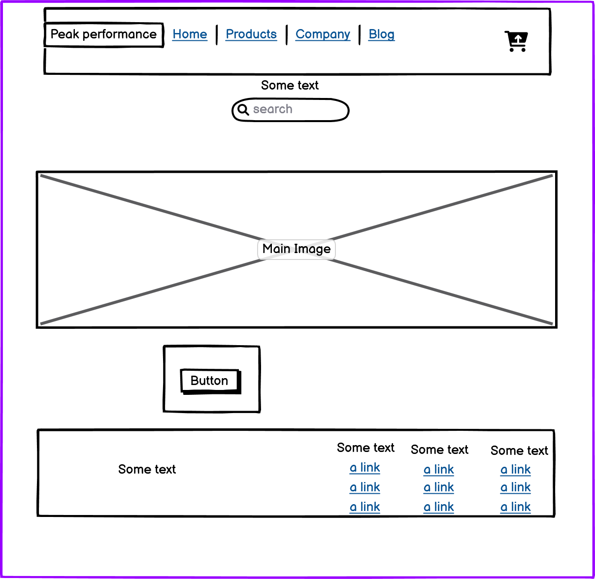
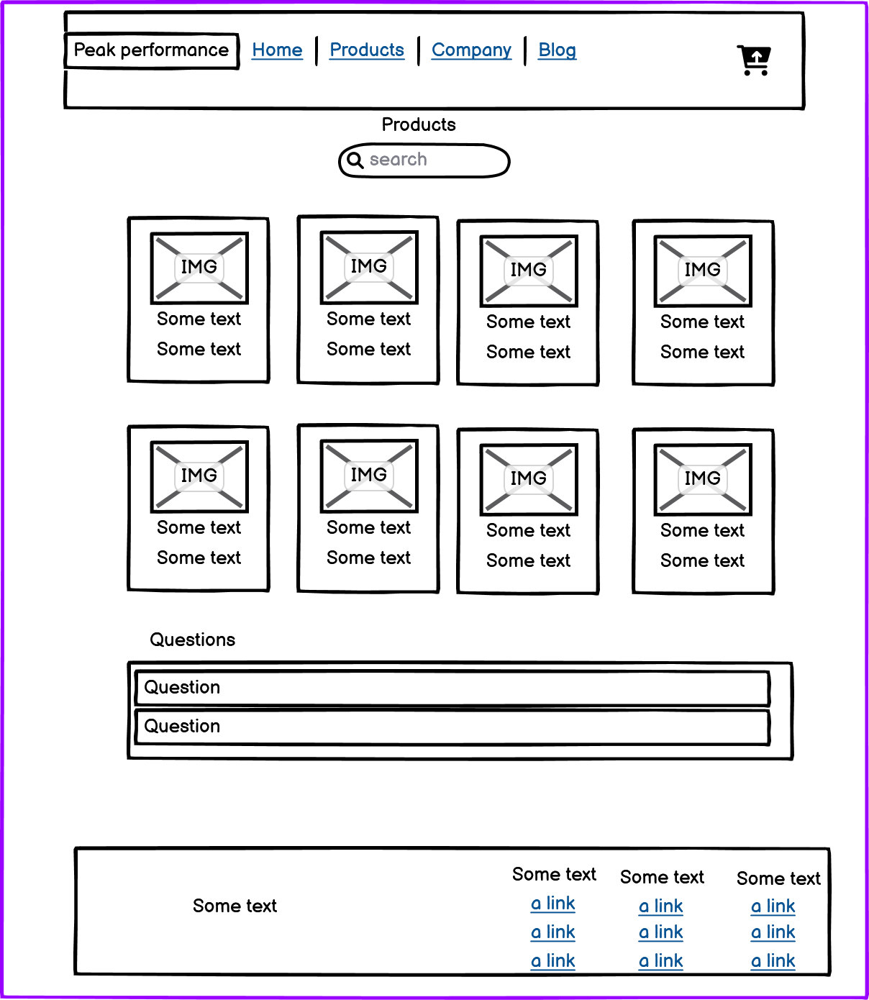
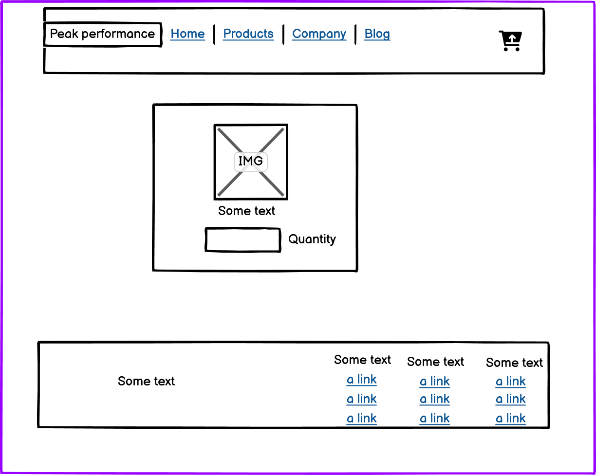
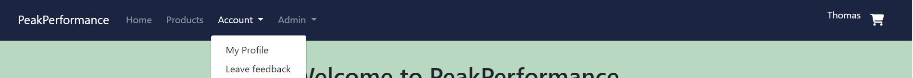
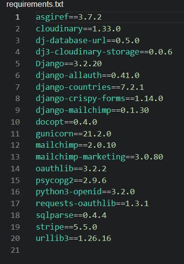

# PeakPerformance

------------------------------------
 

 

-----

## Table of Contents

--------------------------------------

- [About](#about)
- [Design](#design)
- [Agile Development](#agile-development)
- [Features](#features)
- [Testing](#testing)
- [Technologies Used](#technologies-used)
- [Deployment](#deployment)
- [Credits](#credits)

 

------
 

 

## About

 

[PeakPerformance]()

Welcome to Peak Performance, your one-stop destination for all things fitness! Our gym website is dedicated to helping you reach the pinnacle of your fitness journey. Explore our extensive range of premium nutritional products, carefully curated to fuel your body and optimize performance. Elevate your workouts with top-notch gym equipment designed to push your limits and achieve your goals. Show off your style and dedication with our stylish and comfortable apparel, perfect for both in and out of the gym. Whether you're a seasoned fitness enthusiast or just starting, Peak Performance is here to support you every step of the way, ensuring you reach new heights in your fitness endeavors. Unleash your true potential with us!

 

---

 

---

E-Commerce Model

EliteTechPC is an e-commerce platform that specializes in selling high-quality prebuilt PCs to consumers. Our mission is to provide customers with the top-of-the-line computer systems that deliver exceptional performance, reliability and value. Target market includes both gaming enthusiasts and professionals in need of high-performance machines. We cater to individuals who value superior hardware components, seamless functionality and latest advancements in technology. This is a Business to Consumer model and it is catered to be as simple yet intuitive for the consumer along with the sign-ups to the newsletter with potential deals and more.

 

business owner goal

The business owner's goal is to establish a successful eCommerce platform for selling prebuilt PCs. They aim to expand their customer base by offering a visually appealing website with a seamless and secure payment system. The owner also wants to have the ability to manage the product inventory and make updates or changes through a secure and interactive front-end interface. There is a lot of startups starting these type of stores and there is a lot of competition.

Project Goals
EliteTechPC is my final Portfolio Project for Code Institute's Diploma in Full Stack Software Development (E-Commerce Applications). It is a Full Stack website focused on implementing business logic to manage a centralized database.

 

## Design/UX

 

#### Structure of the app

 

The app is designed to have a natural flow, with the main focus on basic crud functionality. All the pages include a header with navagation links to login/logout/sign up and links to all the pages. The website includes a footer at the bottom of each page with links to social media.

 

-----

 

#### Wireframes

 

 

I used Balsamiq to build wireframes for the website before I began developement.

 

 

- Wireframe for the Home page

 

 

- Wireframe for the products page

 

-------------

 

- Wireframe for the product detail page

 

 

-------------

 
 

## Agile Development

 

I employed the Agile approach for my project, highlighting collective effort, adaptability, and client contentment. A fundamental element in Agile methodology is the use of user stories.

I orchestrated and oversaw user stories for my web project through GitHub issues. I formulated user stories pertaining to the capabilities and functionalities.

I charted out my user stories onto the GitHub project board for my website. I established a dedicated GitHub repository for my undertaking and leveraged the GitHub project tool to monitor the user stories. Each user story was interlinked with a corresponding GitHub issue, and priority levels were indicated using distinct labels.
 

 

---

### User Stories

 

 

I brainstormed these User Stories and used Github projects feature to track them

 

- Epic 1: User Register
  

As a Site user I can register an account for the website so that I can use the websites main features

Acceptance Criteria

User can register an account with username and password.
Redirected to home page

 

- Epic 2: Cart Fuctionality
  

 

- Epic 3: Contact
  

 

- Epic 4: Stripe
  

 

-

 
  

 

------

 

## Features

 

### Home Page

 

The home page gives the user information about the website. It allows them to register/login/logout and navagate to the Expenses page.

 

 

---------
 

### Expenses Page

 

THe expenses page allows users to create, add, update and delete expenses. They can adjust their total budget and see the expenses total subtracted from it. It also allows them to register/login/logout and navagate to the Home page

 

 

---------

 

### Nav Bar

The nav bar allows site users to signup/login/register and visit each page.

 

---------

 

### Footer

 

The footer provides site users with links to social media.

 

 

---------

 

### User Register

 

This feature allows new users to register an account on the website. Users will need to provide two basic pieces of information which is their username and password to create an account. Once registered, they will be able to log in to your website and access the features that are available to registered users.

 

 

---------

 

### User Login

 

This feature allows users who have already registered an account to log in to the website. Users will need to enter their username and password to access their account. Once logged in, they will be able to view their expenses, add new expenses, and use the budget calculator.

 

 

-----------

 

### User Logout

 

User logout: This feature allows users to log out of their account when they are finished using the website. Logging out ensures that their account remains secure and that no one else can access their expenses.

 

 

---------------

 

### Budget calculator

 

This feature allows users to set a budget for a specific period, such as a month or a week, and track their expenses against that budget. Users can input their budget and their expenses will be subtracted from it. The calculator shows how much of their budget is left to spend

 

 

 

----------

 

### Read Expenses

 

This feature allows users to view their existing expenses. Users can see a list of all their expenses on a single page.This feature helps users keep track of their spending and identify areas where they might need to cut back.

 

 

------

 

### Create Expenses

 

This feature allows users to add new expenses to their account. Users can input details such as the date, amount and namen of each expense. This feature makes it easy for users to record their spending.

 

 

---------

 

### Update Expenses

 

This feature allows users to edit or update their existing expenses. Users can modify the details of an expense such as the date, amount, category, or description. This feature is useful when users make a mistake or need to make changes to their expenses.

 

 

------

 

### Delete Expenses

 

This feature allows users to remove an expense from their account. Users can delete an expense they no longer need, such as an expense that was entered in error or a duplicate expense. This feature helps users keep their expense records organized and up to date.

 

 

------------

 

## Testing

 
 

The testing strategy for the website can be found here [Testing.md](https://github.com/Thomas-Longworth/Expense-tracker/blob/main/TESTING.md)

 

-----

 

## Technologies used

- HTML5: Usedfor the structure of the website.

- CSS: To style the website

- JavaScript: Used to add interactiviy to website.

- Python: Used to program django.

- Django: This was the main framework for the website..

- ElephantSQL: Used to host PostgreSQL database.

- Balsamiq: Used to design the websites wireframe.

 

### Packages used

 

 

----------

 

 

## Deployment

 

The site was deployed via Heroku, and the live link can be found here - [SpendWise](https://expense-tracker-101.herokuapp.com/)

 

### Project Deployment

 

I deployed my project to Herou using the following steps:

- Login to [Heroku](https://www.heroku.com/).
- On the Heroku website, navagate to "Create New App".
- Name the project.
- This will create the app within Heroku and bring you to the deploy tab. From the submenu at the top, navigate to the resources tab.
- Navagage to the Resources Tab and add 'Heroku Postgres' to the Add ons.
- Go to the settings tab, and copy the DATABASE_URL to the Config vars.
- Create an env.py file in the djagno repository. Import the os library and set the environment variable for the DATABASE_URL pasting in the address copied from Heroku. It should look like this: os.environ["DATABASE_URL"] = "Pasted URL".
- In the env.py file, create a secret key. It should look like this: os.environ["SECRET_KEY"] = " Your Secret key ".
- Copy your secret key and paste it into a Heroku config var. Use SECRET_KEY as the var key.
- Copy and paste the following into your projects settings.py file : from pathlib import Path, import os, import dj_database_url,if os,path.isfile("env.py"):import env.
- Remove djangos insecure key and replace it with: SECRET_KEY = os.environ.get('Your secret key').
- Comment out the database section the setting.py file. Replace it with: DATABASES = { 'default': dj_database_url.parse(os.environ.get("DATABASE_URL"))} .
- Add DISABLE_COLLECTSTATIC to Heroku Config Vars. Set the value to 1.
- Link the file to the templates directory in Heroku. Under the BASE_DIR line, insert the following  { TEMPLATES_DIR = os.path.join(BASE_DIR,'templates') }.
- Change the templates directory to TEMPLATES_DIR. It should look like this 'DIRS': [TEMPLATES_DIR].
- Add Heroku Hostname to ALLOWED_HOSTS. It should look like this:  ALLOWED_HOSTS =["ProjectName.herokuapp.com", "localhost"].
- Create 3 new folders on top level directory: media, static, templates.
- In the Settings.py file - add the STATIC files settings - storagepath, the url, directory path, root path, media url and default file storage path.
- Make a new file call Procfile. Add the following code: web: gunicorn ProjectName.wsgi
- Add, commit and push all changes to Github.
- Navigate to the deployment tab in Heroku. Link your github repo to Heroku and deploy the branch manually. View the build log for any errors. It will dipslay a link to the live site.

 

### Forking the project

 

- Sign/regester in to Github and go to my repository at <https://github.com/Thomas-Longworth/Expense-tracker> .
- Navagage the Fork button at the top right of the page and select it.
- The fork is now created and copied to your repositories.

 

### Cloning the project
  
- Sign/regester in to Github and go to my repository at <https://github.com/Thomas-Longworth/Expense-tracker> .
- Select the green ‘code’ button.
- Choose which clone option you want(HTTPS, SSH or Github CLI).
- Copy the url.
- Open git bash
- Type ‘git clone’ and then paste the URL you copied. Press Enter.

 

--------

 

 

## Credits

 

- The images were downloaded from the website pexels.com and I-stock.com
- The footer social media Icons were generated from font awesome
- The base template for the project was used from Code Institutes "Boutique-ado" walktrough.
- I used Code institute's walthrough projects "Hello Django" and "I think, therefore I blog" to learn the Django fundamentals

 

-------------
seo

I researched keywords for high voloume with little 
i add decriptive tages for the images
I tried include keywords in the projects html elements alos
I changed the image file name to be more descriptive