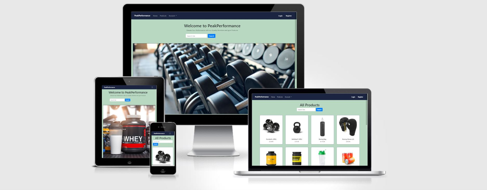

# PeakPerformance

 

-----

## Table of Contents

--------------------------------------

- [About](#about)
- [Objectives](#objectives)
- [Design](#design)
- [Agile Development](#agile-development)
- [Features](#features)
- [Testing](#testing)
- [Technologies Used](#technologies-used)
- [Deployment](#deployment)
- [Credits](#credits)

 

------

 

## About

[Live Site](https://peak-perfomance-2c33a326e9fb.herokuapp.com)

Welcome to Peak Performance. This website is dedicated to helping you reach the pinnacle of your fitness journey. Explore our extensive range of gym equipment, nutritional products, carefully curated to fuel your body and optimize performance. 

---
 

## Objectives

 

### Project Goals

PeakPerformance is my fifth and final Portfolio Project for Code Institute's Diploma in Full Stack Software Development (E-Commerce Applications). It is a Full Stack website at showcasing skill in HTML,CSS,Javascript,Bootstrap, Python and Django.

 

### E-Commerce Model

PeakPerformance is an B2C e-commerce platform that specializes in selling gym/nutritional/apparel products to consumers. The goal is to provide customers with  good value, high quality products. The website is aimed at fitness enthusiasts of all ages. This is a Business to Consumer model and it aimed at appealing to both customers and site guests. It features a newsletters signup form where customer will be offered incentives such as exclusive deals, discounts, or relevant content to encourage signups.

 

### Target audience

The target audience for Peak Performance includes individuals who are interested in fitness, health, and improving their overall well-being. 

- Fitness Enthusiasts: These are individuals who are actively engaged in fitness activities, such as weightlifting, running, yoga, or crossfit. They might be looking for high-quality gym equipment and apparel to support their workouts.
  
- Health-Conscious Individuals: People who prioritize their health and wellness, and are looking for nutritional supplements, vitamins, and other products to support their balanced diets.

- Beginners: Those who are new to fitness and are seeking guidance, equipment, and clothing to start their fitness journey. 

- Athletes: Competitive athletes in various sports who need specialized equipment and nutrition products to enhance their performance and recovery.

- Weight Loss Seekers: Individuals aiming to lose weight or maintain a healthy weight through proper nutrition and exercise. They might be interested in nutritional products and exercise equipment that help them achieve their goals.

- Bodybuilders: Those who focus on building muscle mass and strength. They might need specific nutritional supplements and gym equipment tailored to their goals.

 

### Buisness Owner

The buisness owner aims to create a thriving eCommerce site for nutritional products, gym equipment and apparel which attracts more customers through an attractive design and secure payments. They seek an interactive frontend to manage inventory effectively. They will be able to add, edit and delete stock when nessasary.

 

### Search Engine Optimisation

During desing and development, I put focus on Search Engine Optimisation for the website. I did keyword research to identify the most relevant words that were not too high in volume. I included these keywords in the meta tag descriptions. I also placed the keywords on each of the websites pages  For images, I used descriptive file names and alt tags to improve the visibility of my website. I used different rel tags for the external website links as well.

 

### Marketing  Strategy 

I successfully implemented an effective marketing strategy for my ecommerce website through a dedicated Facebook business page. Leveraging the power of social media, I crafted engaging and informative images that showcases the products.This comprehensive approach of buildina a Facebook business page significantly expanded the online presence of the website, attracting a larger customer base and contributing to increased sales and brand loyalty.

I added of a newsletter signup form from MailChimp for the purposes of digital marketing.
 

[PeakPerformance Facebook](https://www.facebook.com/profile.php?id=61550356434270)

 
---

 

## Design/UX

 

### Structure of the app

The app is designed to have a natural flow, with the main focus on showcasing the quality inventory. All the pages include a header with navagation links to login/logout/sign up and links to all the pages. The website includes a footer at the bottom of each page with links to social media.

### Entity Relationship Diagram

### Wireframes

 

 

I used Balsamiq to build wireframes for the website before I began developement.

 

 

- Wireframe for the Home page

 

 

- Wireframe for the products page

 

-------------

 

- Wireframe for the product detail page

 

 

-------------

 
 

## Agile Development

 

I employed the Agile approach for my project, highlighting collective effort, adaptability, and customer contentment. A fundamental element in Agile methodology is the use of user stories.

I oversaw user stories for my web project through GitHub issues. I formulated user stories pertaining to the capabilities and functionalities.

I charted out my user stories onto the GitHub project board for my website. I established a dedicated GitHub repository for my undertaking and leveraged the GitHub project tool to monitor the user stories. Each user story was interlinked with a corresponding GitHub issue, and priority levels were indicated using distinct labels. These labels were "must have" and "could have".

 

## User Stories

 

### Epic 1: User Authentication
  
 

#### User story: User Register

As a Site user I can register an account for the website so that I can use the websites main features

#### Acceptance Criteria

- User can register an account with username and password.
- Redirected to home page

---

#### User story: User Login

As a User I can login in to my account so that I can view profile and purchase products

#### Acceptance Criteria

- User can login and see their name in navbar

---

#### User story: User logout

As a Site User I can logout of my account so that I can stop using website features

#### Acceptance Criteria

- User can logout. No longer can view profile page.

---

 

### **Epic 2: Products**

 

#### User story: Product display

As a Site owner I can a display a list of the stores producta  so that a the customer can see them

#### Acceptance Criteria

- Products page contains all the product cards

---

#### User story: Product Search

As a Site User I can use a search bar for the website products so that find a product quickly

#### Acceptance Criteria

- User can find a product by typing words that correspond to its name or description

---

#### User story: Add new Product

As a Admin I can add a new product so that I can increase the stores stock

#### Acceptance Criteria

- A form page for admin to add a new product to the store

---

#### User story: Edit product

As a Site owner I can edit an existing product so that I update it for the store

#### Acceptance Criteria

- Admin can edit the product with a button on the products page

---

#### User story: Remove product

As a Site owner I can delete a product so that I can remove unneeded stock

#### Acceptance Criteria
 
- Admin can delete a product from the product page

---

 

### **Epic 3: Cart Fuctionality**
  

 

#### User story: Add to cart
As a Site User I can add a product to the cart so that proceed to purchasing it

#### Acceptance Criteria

- Form available to add product to bag
User can change quantity in the form

---

#### User story: Remove from cart
As a Site User I can remove a product from cart so that I can change my order

#### Acceptance Criteria

- In cart page, User has button to remove particular product from cart.

---

 

### **Epic 4: Contact**

 

#### User story: Admin Q&A

As a Site Owner I can answer the customers questions form** so that I give them the required info

#### Acceptance Criteria

- Site owner can submit an answer with front end form

---

#### User story: Customer Q&A

As a Site user I can ask and view questions about the products so that get better understanding of the products

#### Acceptance Criteria

- User can view a list of questions

- User can submit a new question

---

#### User story: Customer feedback
As a Site user I can submit a feedback form so that I can review the website and its product

#### Acceptance Criteria

- User can submit a form including the Product 

---

#### User story: View feedback

As a Site owner I can view customers feedback forms so that I can learn ways to improve the website

#### Acceptance Criteria

- Site owner can view a feedback page with the submitted forms from customers

---

#### User story: Request Refund

As a Site user I can submit a refund form so that I can get my money back if product is not up to standard

#### Acceptance Criteria

- User can submit a request form with their order number

---

#### User story: Refund page

As a Site owner I can view a page with all the refund requests so that begin processing refunds

#### Acceptance Criteria

- Owner can view a page with a table of the refunds

---

#### User story: Newsletter

As a Site user I can sign up to the websites newsletter so that I can receive the latest offers and news

#### Acceptance Criteria

- Site user can submit their email in a frontend form

---

 

### Epic 5: **Checkout**

 

#### User story : Stripe/Checkout

As a Site user I can checkout my products so that I can pay and receive my products

#### Acceptance Criteria

- User can fill out their profile and card details.
  
- Stripe handles payment

---

 

 

------

 

## Features

 

### Navagation Bar

The nav bar allows site users to signup/login/register and visit each page. It features a cart link on right side and drop-down menus for account and admin

 

### Home Page

The home page gives the user information about the website. It allows them to register/login/logout and navigate to the products page. It features a carousel of three images.

### Footer

The footer provides site users with links to the facebook buisness page. It also contains links to the different website pages

### Registering an account

This feature allows users to register an account on the website. Users will need to enter their username and password to access their account. Email is optional. Once logged in, they will be able to unlock and use all the website features.

### Products

All the products in the inventory are listed on the product page.

### Add Product

This feature allows the admin to add a new product to the inventory. 

### Edit Product

This feature allows the admin to edit or update their existing products in the inventory. They can modify any details. This feature is useful when a mistake was made or the price has changed etc.

### Profile page
This is the profile page where the customers information and order history is stored. The information is updated every time a order is made. The customer also has front end form to update their details.

### Feedback page

This is an optional form page for the user to submit feedback/review on a product they bought.

### Feedback view page

This feature is an admin only page to view all the feedback that the website has recieved.

### Refund request 

This is an form page for the user to submit a refund request on a product they bought.

### Refund view page

This feature is an admin only page to view all the refund requests that customers have submitted

### Search bar

This feature allows the site user to search for specific products. They can search for specific words or characters that are found in the products name or description.

### Q&A section

This feature is placed on the product page and it allows site users to ask general questions to the owner/admin. As of now, there is no functionality for the admin to respond yet

### Newsletter

This page is dispaly a sign up form for the customer to receive news and offers. It is built with MailChimp and all emails are stored in the contacts

### Shopping cart page

The cart page displays the products that the customer has added to it. They also have the ability to remove that particular product.

### Checkout page

This is the checkout page for the customer to add their information and card details

### Stripe

The website is intergrated with the the Stripe API to handle payments. To use a mock payment, enter the following card details 

Card Number: 4242424242424242
Expiration Date:  42/42
CVN: 424

 

---------

 

## Testing

The testing strategy for the website can be found here [Testing.md]

 

-----

 

## Technologies used

- HTML5: Usedfor the structure of the website.

- CSS: To style the website

- JavaScript: Used to add interactiviy to website.

- Python: Used to program django.

- Django: This was the main framework for the website

- ElephantSQL: Used to host PostgreSQL database.
  
- Bootstrap for the frontend

- Balsamiq: Used to design the websites wireframe.

- Stripe payments: Used api for test card payments

 

### Packages used

 

 

----------

 

 

## Deployment

 

The site was deployed via Heroku, and the live link can be found here - [PeakPerformance](<https://peak-perfomance-2c33a326e9fb.herokuapp.com/>)

 

The static files are hosted on Cloudinary[Cloudinary](https://console.cloudinary.com/users/register_free)

### Project Deployment

 

I deployed my project to Herou using the following steps:

- Login to [Heroku](https://www.heroku.com/).
- On the Heroku website, navagate to "Create New App".
- Name the project.
- This will create the app within Heroku and bring you to the deploy tab. From the submenu at the top, navigate to the resources tab.
- Navagage to the Resources Tab and add 'Heroku Postgres' to the Add ons.
- Go to the settings tab, and copy the DATABASE_URL to the Config vars.
- Create an env.py file in the djagno repository. Import the os library and set the environment variable for the DATABASE_URL pasting in the address copied from Heroku. It should look like this: os.environ["DATABASE_URL"] = "Pasted URL".
- In the env.py file, create a secret key. It should look like this: os.environ["SECRET_KEY"] = " Your Secret key ".
- Copy your secret key and paste it into a Heroku config var. Use SECRET_KEY as the var key.
- Copy the STRIPE_PUBLIC_KEY and STRIPE_SECRET_KEY and paste into Heroku env var.
- Copy the cloudinary api key and past into Heroku env var
- Copy and paste the following into your projects settings.py file : from pathlib import Path, import os, import dj_database_url,if os,path.isfile("env.py"):import env.
- Remove djangos insecure key and replace it with: SECRET_KEY = os.environ.get('Your secret key').
- Comment out the database section the setting.py file. Replace it with: DATABASES = { 'default': dj_database_url.parse(os.environ.get("DATABASE_URL"))} .
- Add DISABLE_COLLECTSTATIC to Heroku Config Vars. Set the value to 1.
- Link the file to the templates directory in Heroku. Under the BASE_DIR line, insert the following  { TEMPLATES_DIR = os.path.join(BASE_DIR,'templates') }.
- Change the templates directory to TEMPLATES_DIR. It should look like this 'DIRS': [TEMPLATES_DIR].
- Add Heroku Hostname to ALLOWED_HOSTS. It should look like this:  ALLOWED_HOSTS =["ProjectName.herokuapp.com", "localhost"].
- Create 3 new folders on top level directory: media, static, templates.
- In the Settings.py file - add the STATIC files settings - storagepath, the url, directory path, root path, media url and default file storage path.
- Make a new file call Procfile. Add the following code: web: gunicorn ProjectName.wsgi
- Add, commit and push all changes to Github.
- Navigate to the deployment tab in Heroku. Link your github repo to Heroku and deploy the branch manually. View the build log for any errors. It will dipslay a link to the live site.

 

### Forking the project

 

- Sign/regester in to Github and go to my repository at <https://github.com/Thomas-Longworth/Expense-tracker> .
- Navagage the Fork button at the top right of the page and select it.
- The fork is now created and copied to your repositories.

 

### Cloning the project
  
- Sign/regester in to Github and go to my repository at <https://github.com/Thomas-Longworth/Expense-tracker> .
- Select the green ‘code’ button.
- Choose which clone option you want(HTTPS, SSH or Github CLI).
- Copy the url.
- Open git bash
- Type ‘git clone’ and then paste the URL you copied. Press Enter.

 

--------

 

### Forking the project

 

- Sign/regester in to Github and go to my repository at <https://github.com/Thomas-Longworth/PeakPerformance> .
- Navagage the Fork button at the top right of the page and select it.
- The fork is now created and copied to your repositories.

 

### Cloning the project
  
- Sign/regester in to Github and go to my repository at <https://github.com/Thomas-Longworth/PeakPerformance> .
- Select the green ‘code’ button.
- Choose which clone option you want(HTTPS, SSH or Github CLI).
- Copy the url.
- Open git bash
- Type ‘git clone’ and then paste the URL you copied. Press Enter.

 

## Credits

 

- The images were downloaded from the website pexels.com and I-stock.com
- The footer social media Icons were generated from font awesome
- The base template for the project was used from Code Institutes "Boutique-ado" walktrough.
- I used Code institute's walthrough projects "Hello Django" and "I think, therefore I blog" to learn the Django fundamentals

 
