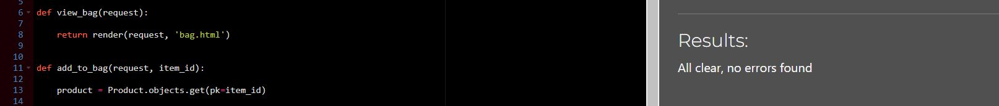
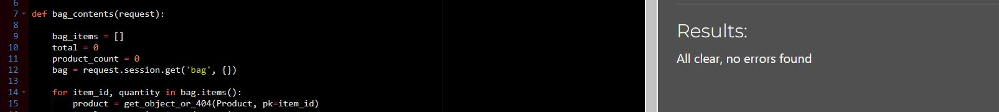
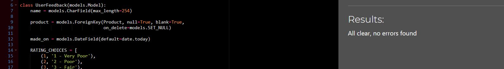
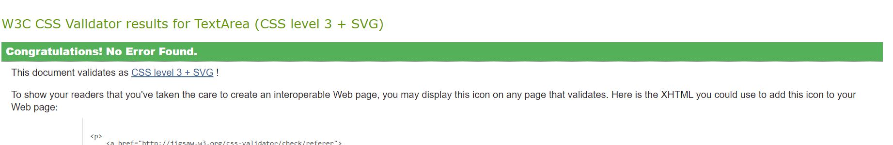

## Testing

## Table of Contents

--------------------------------------

 

- [Testing Strategy](#testing-strategy)
- [User story testing](#user-story-testing)
- [Validator Testing](#validator-testing)
- [Manual Testing](#manual-testing)
- [Bugs](#bugs)

------

 

## Testing Strategy

 

I decided on a manual testing strategy for the development of the site. I did this to ensure the website is user-friendly and check issues with navigation, layout, and usability that may not be apparent through automated testing.

 

------------

 

 

## User Story Testing

 

### Epic 1: User Authentication
  
 

#### User story: User Register

>As a Site user I can register an account for the website so that I can use the websites main features

#### Acceptance Criteria

- User can register an account with username and password.
- Redirected to home page

### **All tests passed**    [x]

---

#### User story: User Lo>gin

>As a User I can login in to my account so that I can view profile and purchase products

#### Acceptance Criteria

- User can login and see their name in navbar

### **All tests passed**    [x]

---

#### User story: User logout

>As a Site User I can logout of my account so that I can stop using website features

#### Acceptance Criteria

- User can logout. No longer can view profile page.

### **All tests passed**    [x]

---

 

### **Epic 2: Products**

 

#### User story: Product display

>As a Site owner I can a display a list of the stores producta  so that a the customer can see them

#### Acceptance Criteria

- Products page contains all the product cards
  
### **All tests passed**    [x]

---

#### User story: Product Search

>As a Site User I can use a search bar for the website products so that find a product quickly

#### Acceptance Criteria

- User can find a product by typing words that correspond to its name or description

### **All tests passed**    [x]

---

#### User story: Add new Product

>As a Admin I can add a new product so that I can increase the stores stock

#### Acceptance Criteria

- A form page for admin to add a new product to the store

### **All tests passed**    [x]

---

#### User story: Edit product

>As a Site owner I can edit an existing product so that I update it for the store

#### Acceptance Criteria

- Admin can edit the product with a button on the products page

### **All tests passed**    [x]

---

#### User story: Remove product

>As a Site owner I can delete a product so that I can remove unneeded stock

#### Acceptance Criteria

- Admin can delete a product from the product page

### **All tests passed**    [x]

---

 

### **Epic 3: Cart Fuctionality**
  
 

#### User story: Add to cart

>As a Site User I can add a product to the cart so that proceed to purchasing it

#### Acceptance Criteria

Form available to add product to bag
User can change quantity in the form

### **All tests passed**    [x]

---

#### User story: Remove from cart

>As a Site User I can remove a product from cart so that I can change my order

#### Acceptance Criteria

- In cart page, User has button to remove particular product from cart.

### **All tests passed**    [x]

---

 

### **Epic 4: Contact**

 

#### User story: Admin Q&A

>As a Site Owner I can answer the customers questions form** so that I give them the required info

#### Acceptance Criteria

- Site owner can submit an answer with front end form

### **All tests passed**    [x]

---

#### User story: Customer Q&A

>As a Site user I can ask and view questions about the products so that get better understanding of the products

#### Acceptance Criteria

- User can view a list of questions.

- User can submit a new question

### **All tests passed**    [x]

---

#### User story: Customer feedback

>As a Site user I can submit a feedback form so that I can review the website and its product

#### Acceptance Criteria

- User can submit a form including the Product and its category

### **All tests passed**    [x]

---

#### User story: View feedback

>>As a Site owner I can view customers feedback forms so that I can learn ways to improve the website

#### Acceptance Criteria

- Site owner can view a feedback page with the submitted forms from customers

### **All tests passed**    [x]

---

#### User story: Request Refund

>As a Site user I can submit a refund form so that I can get my money back if product is not up to standard

#### Acceptance Criteria

- User can submit a request form with their order number

### **All tests passed**    [x]

---

#### User story: Refund page

>As a Site owner I can view a page with all the refund requests so that begin processing refunds

#### Acceptance Criteria

- Owner can view a page with a table of the refunds

### **All tests passed**    [x]

---

#### User story: Newsletter

>As a Site user I can sign up to the websites newsletter so that I can receive the latest offers and news

#### Acceptance Criteria

- Site user can submit their email in a frontend form

### **All tests passed**    [x]

---

 

### Epic 5: **Checkout**

 

#### User story : Stripe/Checkout

>As a Site user I can checkout my products so that I can pay and receive my products

#### Acceptance Criteria

- User can fill out their profile and card details.
  
- Stripe handles payment

### **All tests passed**    [x]

---

 
----------

-------

--------------

 

## Validator testing

 

----------

 

## Python pep 8

 

All the custom Python code was was tested manually thoughout the project and with the following pep8 validator.
There are some minor errors for lines too long and I left them as they dont affect readability

 
 

### Main project folder

 

- Settings.py
- Urls.py

 

---

### Products App

- views.py
- forms.py
- admin.py
- model.py
  

---

 

### Checkout App

- views.py
- models.py
- forms.py
- admin.py

 

---

### Bag App

- views.py
- context.py

---

### Profile App

- views.py
- forms.py
- models.py

---

 

### Feedback app

- views.py
- models.py
- forms.py

---

### Refund App

- views.py
- models.py

---

---------------------

 
 

## WC3 HTML Validatior

 

- Index.html
  

- Products.html

--------------

 

## WC3 CSS Validatior

 

- Style.css

- Checkout.css
  

---

 

## Light house testing

 

- Index.html
  

- Products.html
  

---

 

 

------------------

 

 

## Manual Testing

 

----
 

### Site responsiveness

 

- I manually tested the responsiveness of the website on many devices. I used Chrome DevTools to simulate different screen sizes also. I made sure there were not significant issues such as overlapping text, images not scaling properly, and buttons that are difficult to click.

 

 

---------

 

### Browser compatiabiliy

 

- I checked that the website worked in the following browsers: Google Chrome, Mozilla Firefox, Apple Safari, Microsoft Edge.

 

-------

## Bugs

 

- Sometimes, the user will get a 404 page error when they try to delete an expense. To reproduce the bug, the user needs to delete a large number of expense items. This bug is currently unresolved.

 

 

-------

 
